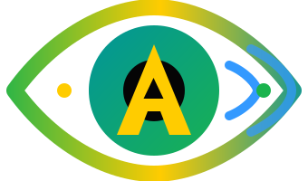

# A-Eyes — Rapport Rendu 3

## Description du prototype et première expérience d'utilisation

---

# 1. Description détaillée du prototype

## 1.1 Présentation générale

A-Eyes, entendre le monde, retrouver l’essentiel.

A-Eyes est une application d'assistance visuelle destinée aux personnes malvoyantes ou aveugles. Elle fonctionne via un navigateur web (Chrome ou Edge recommandés) et utilise :
- La caméra du téléphone ou de l'ordinateur pour capturer des images
- L'intelligence artificielle (GPT-4.1-mini) pour analyser les scènes
- La synthèse vocale (TTS) pour restituer les informations à haute voix
- La reconnaissance vocale pour permettre un contrôle main-libre

L'application est conçue pour être utilisée sans voir l'écran : toutes les interactions sont vocales ou tactiles (gros boutons couvrant tout l'écran).

## 1.2 Fonctionnalités principales

### DESCRIBE — Description rapide de la scène
- Capture une photo et décrit la scène en une phrase
- Cas d'usage : savoir rapidement ce qui se trouve devant soi (pièce, rue, personne, objet)

### TEXT — Lecture du texte visible
- Capture une photo et lit à voix haute tout texte visible
- Cas d'usage : lire un panneau, une étiquette de prix, un menu de restaurant, un courrier

### DETAILS — Description approfondie
- Fournit une description précise (2-3 phrases) de la dernière image capturée
- Inclut les positions, couleurs, lumière et détails spatiaux
- Cas d'usage : comprendre l'agencement d'une pièce, la disposition d'objets sur une table

### ASK — Question libre sur l'image
- Permet de poser une question à voix haute sur la dernière image analysée
- Cas d'usage : "De quelle couleur est la porte ?", "Y a-t-il du texte sur ce papier ?"

### FIND — Recherche guidée d'objet (nouveauté V4)
- Recherche un objet nommé par l'utilisateur et guide vocalement vers lui
- Instructions directionnelles : "Turn right", "Straight ahead, almost there", "Found it!"
- Bips sonores : bip neutre (photo prise), double bip aigu (trouvé), bip grave (hors champ)
- Cas d'usage : retrouver ses clés, son téléphone, une télécommande, un objet posé quelque part

### REPEAT — Répétition du dernier message
- Relit le dernier message prononcé par l'application

### STOP — Arrêt immédiat
- Interrompt toute lecture vocale ou recherche FIND en cours

## 1.3 Scénarios d'utilisation

### Scénario 1 : Lecture d'une étiquette de prix au supermarché
Leila, 34 ans, malvoyante, fait ses courses. Elle prend un produit et dit "text". L'app capture l'étiquette et annonce "Yaourt nature bio, 500g, 2 euros 45". Elle repose le produit ou le met dans son panier.

### Scénario 2 : Orientation dans une pièce inconnue
Marc, 45 ans, aveugle, entre dans une salle de réunion. Il dit "describe". L'app répond "Large conference room with oval table, eight chairs, projector screen on the far wall." Il dit "details" pour obtenir plus de précisions : "The table is centered, chairs arranged around it. A window on your left, door behind you. Projector mounted on ceiling."

### Scénario 3 : Retrouver ses clés
Sophie, 28 ans, malvoyante, a posé ses clés quelque part dans le salon. Elle ouvre A-Eyes et dit "find my keys". L'app annonce "Looking for my keys." Sophie balaie lentement la pièce avec son téléphone. L'app dit "Turn left" — elle tourne. "Straight ahead, keep going" — elle avance. "Straight ahead, almost there" — elle s'approche. Double bip + "Found it!" — elle tend la main vers la table basse.

### Scénario 4 : Lecture d'un menu au restaurant
Paul, 62 ans, presbyte sévère, est au restaurant. Il pointe son téléphone vers le menu et dit "text". L'app lit les plats et les prix. Il peut ensuite dire "ask is there a vegetarian option?" pour poser une question sur le menu.

### Scénario 5 : Vérification d'une tenue vestimentaire
Emma, 35 ans, aveugle, s'habille pour un entretien. Elle se filme et dit "describe". L'app décrit "Person wearing navy blue blazer, white shirt, dark pants. Professional appearance." Elle peut demander "ask are the colors matching?" pour vérifier l'harmonie.

---

# 2. Description de la première expérience d'utilisation

## 2.1 Démarrage de l'application

| Manipulation utilisateur | Retour du prototype |
|--------------------------|---------------------|
| Ouvrir l'URL de l'application | Page de chargement |
| Accepter la permission caméra (popup navigateur) | Le flux caméra démarre (invisible pour l'utilisateur) |
| Accepter la permission microphone (popup navigateur) | La reconnaissance vocale est activée |
| Toucher une fois l'écran (obligatoire sur iPhone) | Active l'audio — bips et TTS fonctionnels |
| — | Annonce vocale "A-Eyes ready." |

## 2.2 Utilisation de DESCRIBE

| Manipulation utilisateur | Retour du prototype |
|--------------------------|---------------------|
| Orienter la caméra vers la scène | — |
| Dire "describe" ou appuyer sur le bouton DESCRIBE (vert, pleine largeur) | Photo capturée |
| — | Boutons désactivés temporairement |
| — | Après 1-2 secondes : description vocale de la scène ("Living room with sofa and coffee table.") |
| — | Boutons réactivés |

## 2.3 Utilisation de TEXT

| Manipulation utilisateur | Retour du prototype |
|--------------------------|---------------------|
| Orienter la caméra vers du texte (panneau, étiquette, document) | — |
| Dire "text" ou appuyer sur le bouton TEXT (orange) | Photo capturée |
| — | Lecture vocale du texte visible ("Exit, floor 2, turn right for elevators.") |

## 2.4 Utilisation de DETAILS

| Manipulation utilisateur | Retour du prototype |
|--------------------------|---------------------|
| Après avoir utilisé DESCRIBE ou TEXT | — |
| Dire "details" ou appuyer sur le bouton DETAILS (vert foncé) | — |
| — | Description détaillée de la même image ("The sofa is beige, positioned against the left wall. Coffee table in center, rectangular, dark wood. Window behind the sofa with white curtains, daylight coming through.") |

## 2.5 Utilisation de ASK

| Manipulation utilisateur | Retour du prototype |
|--------------------------|---------------------|
| Après avoir capturé une image | — |
| Dire "ask" ou appuyer sur le bouton ASK (violet) | Annonce "What is your question?" |
| Poser une question à voix haute ("Is there anyone in the room?") | — |
| — | Réponse vocale à la question ("No, the room appears empty.") |

Alternative : dire directement "ask is there anyone in the room?" (question intégrée à la commande).

## 2.6 Utilisation de FIND

| Manipulation utilisateur | Retour du prototype |
|--------------------------|---------------------|
| Dire "find my keys" (ou "find the red cup", "find my phone"…) | Annonce "Looking for my keys." |
| — | Overlay STOP plein écran apparaît |
| — | Bip court neutre (520 Hz) = photo prise |
| Balayer lentement la pièce avec le téléphone | Instructions directionnelles : "Turn left", "Turn right", "Straight ahead, keep going" |
| — | Bip grave descendant si l'objet n'est pas dans le champ |
| — | Silence si la direction ne change pas (utilisateur sur la bonne trajectoire) |
| Suivre les instructions vocales | — |
| — | Quand l'objet est centré et proche : double bip aigu + "Found it!" |
| — | Session terminée automatiquement, overlay disparaît |

Arrêt manuel possible :
| Manipulation utilisateur | Retour du prototype |
|--------------------------|---------------------|
| Dire "stop" ou appuyer sur le bouton STOP rouge (plein écran) | Annonce "Search cancelled." |
| — | Overlay disparaît, boutons réactivés |

Timeout :
| Condition | Retour du prototype |
|-----------|---------------------|
| 30 secondes sans trouver l'objet | Annonce "I cannot find it." |
| — | Session terminée, overlay disparaît |

## 2.7 Utilisation de REPEAT et STOP

| Manipulation utilisateur | Retour du prototype |
|--------------------------|---------------------|
| Dire "repeat" ou appuyer sur le bouton REPEAT (bleu) | Relecture du dernier message prononcé |
| Dire "stop" pendant une lecture vocale | Arrêt immédiat de la synthèse vocale |

## 2.8 Aide

| Manipulation utilisateur | Retour du prototype |
|--------------------------|---------------------|
| Dire "help" | Annonce "Available commands: describe, text, details, ask, repeat, stop, find." |

---

# 3. Questionnaire utilisateurs

Sur la base de cette première expérience d'utilisation, un questionnaire destiné aux futurs utilisateurs a été élaboré pour identifier les axes d'amélioration du produit. Le questionnaire complet est disponible dans le fichier `questionnaire_utilisateurs.md`.

Ci-dessous les bénéfices attendus question par question :

| Question | Bénéfice |
|----------|----------|
| Q1 — Niveau de déficience visuelle | Adapter les fonctionnalités selon le degré de déficience. Un utilisateur totalement aveugle aura des besoins différents d'un malvoyant léger. |
| Q2 — Autres applications utilisées | Identifier les fonctionnalités concurrentes appréciées et les lacunes à combler. |
| Q3 — Appareil utilisé | Prioriser les tests et optimisations sur les plateformes les plus utilisées. |
| Q4 — Facilité de démarrage | Identifier les obstacles au démarrage et simplifier l'onboarding. |
| Q5 — Taille des boutons | Ajuster la taille des boutons pour un confort tactile optimal. |
| Q6 — Disposition des boutons | Optimiser l'ergonomie de l'interface. |
| Q7 — Commandes vocales | Améliorer la reconnaissance vocale et les mots-clés. |
| Q8 — Utilité de DESCRIBE | Affiner le prompt IA pour prioriser les éléments importants. |
| Q9 — Précision de TEXT | Améliorer la détection OCR pour les cas difficiles (texte manuscrit, petite police, faible contraste). |
| Q10 — Valeur ajoutée de DETAILS | Ajuster la différence entre DESCRIBE (vue d'ensemble) et DETAILS (précisions). |
| Q11 — Pertinence de ASK | Améliorer la compréhension des questions et la pertinence des réponses. |
| Q12 — Accessibilité de FIND | Évaluer l'accessibilité de cette nouvelle fonctionnalité. |
| Q13 — Clarté des instructions directionnelles | Affiner le vocabulaire des instructions pour une meilleure compréhension. |
| Q14 — Utilité des bips sonores | Ajuster le volume, la fréquence ou supprimer les bips si non désirés. |
| Q15 — Succès de la recherche FIND | Identifier les cas d'échec et améliorer l'algorithme de guidage. |
| Q16 — Timeout de 30 secondes | Ajuster le timeout pour un équilibre entre efficacité et patience. |
| Q17 — Temps de réponse | Identifier si des optimisations de latence sont nécessaires. |
| Q18 — Erreurs rencontrées | Corriger les bugs et améliorer la stabilité. |
| Q19 — Langue préférée | Prioriser les langues à implémenter. |
| Q20 — Fonctionnalités souhaitées | Identifier les fonctionnalités prioritaires pour les prochaines versions. |
| Q21 — Modèle économique | Définir le modèle économique viable. |
| Q22 — Recommandation | Mesurer la satisfaction globale et identifier les points forts/faibles perçus. |
| Q23 — Commentaires libres | Recueillir des retours non anticipés par les questions précédentes. |
