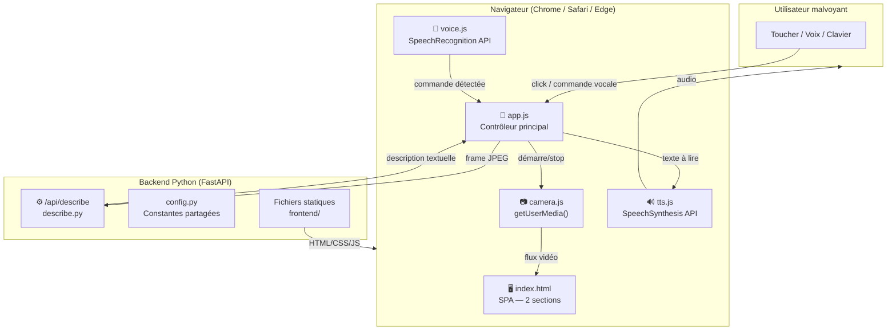
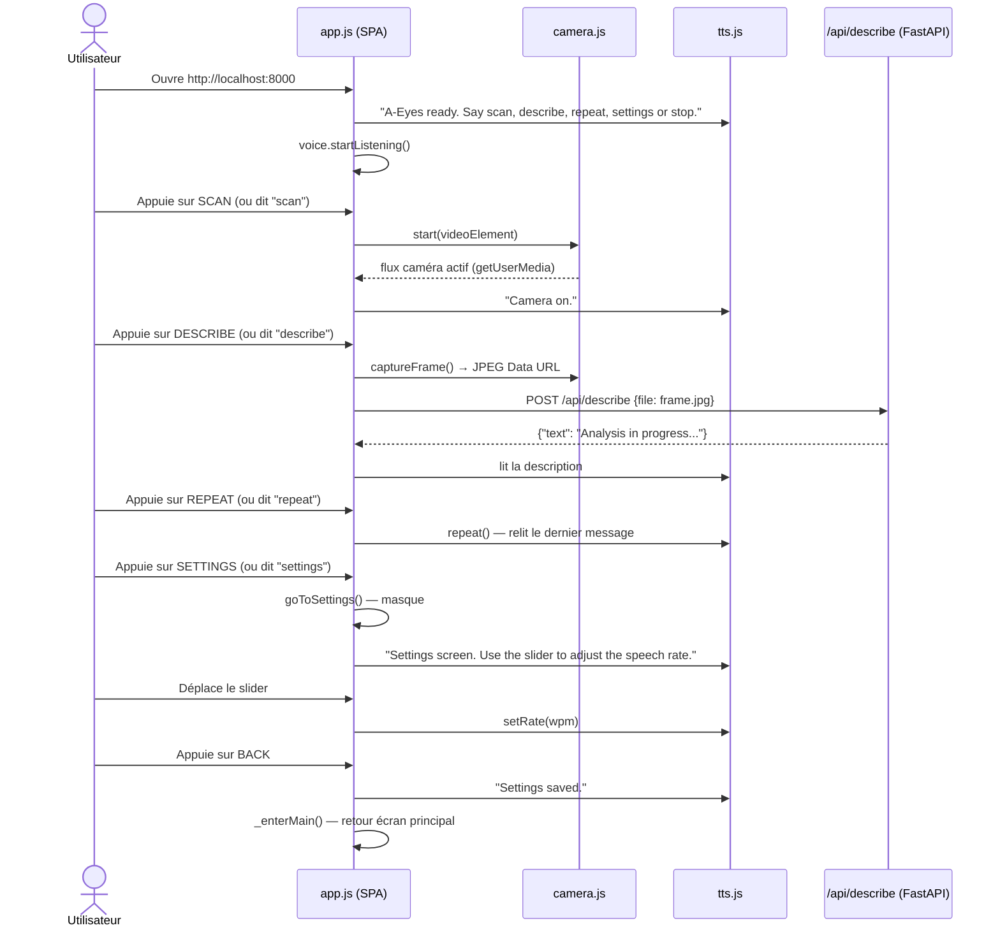

# A-Eyes — Architecture V1 (Application Web)

> **Objectif V1** (réalisé le 19/04/2026) : migrer l'app Kivy (desktop/Android) vers une application web (SPA + backend FastAPI) afin de résoudre les limitations d'accessibilité de Kivy, d'éliminer les dépendances système (win32com, pyaudio, OpenCV) et de rendre l'application accessible depuis n'importe quel navigateur moderne — y compris sur mobile sans APK.

---

## 1. Choix technologique

| Besoin | V0 (Kivy) | V1 (Web) | Justification |
|--------|-----------|----------|---------------|
| Interface graphique | Kivy + `.kv` | HTML/CSS + JS (ES Modules) | UI native navigateur, accessibilité ARIA intégrée |
| Capture caméra | OpenCV (`cv2`) | `MediaDevices.getUserMedia()` | API navigateur — aucune dépendance système |
| Synthèse vocale (TTS) | win32com SAPI / plyer | `SpeechSynthesis` (Web Speech API) | Native navigateur, multiplateforme, pas de thread dédié |
| Commandes vocales | SpeechRecognition + pyaudio + Google STT | `SpeechRecognition` (Web Speech API) | Intégrée au navigateur, auto-restart, même table COMMANDS |
| Backend / IA | Stub (V0) | **FastAPI** + endpoint `/api/describe` | Prêt à brancher un modèle de vision (GPT-4o, Gemini) en V2 |
| Packaging mobile | Buildozer (APK) | **PWA** (manifest + service worker) | "Installer sur l'écran d'accueil" sans store |

> **Résolution du problème d'accessibilité Kivy (cf. architecture V0 §1)**
>
> En V0, Kivy dessinait l'UI via OpenGL ES : TalkBack/VoiceOver ne voyaient qu'un rectangle opaque, aucun bouton n'était annoncé. En V1, l'interface est en HTML sémantique pur. Chaque bouton porte un `aria-label` et un `role` natif, rendant l'application **pleinement compatible avec NVDA, JAWS, VoiceOver (iOS/macOS) et TalkBack (Android)** — sans contournement.

---

## 2. Contraintes non-fonctionnelles V1

| Contrainte (PDF) | Prise en compte en V1 |
|---|---|
| Compatibilité iOS **et** Android (p.6) | Navigateur Chrome/Edge/Safari — aucun APK requis ; PWA optionnelle |
| RGPD — anonymisation (p.6) | Les frames ne quittent pas le navigateur (V1 stub) ; en V2, envoi chiffré HTTPS, aucun stockage serveur |
| Temps de réponse IA < 1s (p.6) | Hors scope V1 (stub). À mesurer lors du branchement V2 |
| Précision > 85% (p.6) | Hors scope V1. À mesurer en V2 |
| Public 50+ / seniors (p.4) | Boutons ≥ 90 px, variables CSS pour adapter les tailles, focus:visible large |
| Baisse de contraste (p.5) | Fond noir + jaune/vert/bleu vif — variables CSS `--btn-scan: #ffcc00` etc. |
| Accessibilité lecteurs d'écran | `aria-label`, `aria-pressed`, `aria-live`, `role` sur tous les composants interactifs |

---

## 3. Architecture générale



---

## 4. Flux d'utilisation V1 (séquence)



---

## 5. Structure des fichiers

```
AYeses/
│
├── backend/                         # Serveur Python FastAPI
│   ├── main.py                      # Point d'entrée — API + serve frontend statique
│   ├── config.py                    # Constantes (TTS_RATE_*, DESCRIBE_STUB_MSG)
│   ├── requirements.txt             # fastapi, uvicorn, python-multipart
│   └── api/
│       ├── __init__.py
│       └── describe.py              # POST /api/describe — stub V1, prêt V2 (IA)
│
├── frontend/                        # Application web (SPA, pas de framework)
│   ├── index.html                   # Page unique : 2 sections (main + settings)
│   ├── css/
│   │   └── style.css                # Fort contraste, variables CSS = config.py
│   └── js/
│       ├── camera.js                # getUserMedia — remplace capture.py
│       ├── tts.js                   # SpeechSynthesis — remplace speaker.py
│       ├── voice.js                 # SpeechRecognition — remplace listener.py
│       └── app.js                   # Contrôleur — remplace main_screen.py + settings_screen.py
│
└── Src/                             # Code Kivy V0 (conservé pour référence)
    └── ...
```

---

## 6. Correspondances V0 → V1

| Fichier V0 (Kivy) | Fichier V1 (Web) | Technologie remplacée |
|---|---|---|
| `main.py` + `a_eyes.kv` | `index.html` + `app.js` | `kivy.App`, `ScreenManager`, `FadeTransition` |
| `ui/main_screen.py` | `app.js` → class `AEyesApp` | `kivy.uix.screenmanager.Screen` |
| `ui/settings_screen.py` | `app.js` → méthodes `goToSettings()` / `goBack()` | `kivy.uix.screenmanager.Screen` |
| `camera/capture.py` | `js/camera.js` → class `Camera` | `cv2.VideoCapture`, `kivy.graphics.texture.Texture` |
| `tts/speaker.py` | `js/tts.js` → class `Speaker` | `win32com.client` (SAPI), `plyer.tts` |
| `voice_input/listener.py` | `js/voice.js` → class `VoiceListener` | `speech_recognition`, `pyaudio` |
| `config.py` (Python) | `css/style.css` variables + `backend/config.py` | Constantes Kivy dp/sp/RGBA |

---

## 7. Extraits de code clés

### `backend/main.py` — Serveur FastAPI
```python
from fastapi import FastAPI
from fastapi.middleware.cors import CORSMiddleware
from fastapi.staticfiles import StaticFiles
from api.describe import router as describe_router

app = FastAPI(title="A-Eyes API", version="0.1.0")
app.add_middleware(CORSMiddleware, allow_origins=["*"], allow_methods=["*"], allow_headers=["*"])
app.include_router(describe_router, prefix="/api")
app.mount("/", StaticFiles(directory="../frontend", html=True), name="frontend")
```

### `frontend/js/camera.js` — Caméra (getUserMedia)
```javascript
async start(videoElement) {
    this._stream = await navigator.mediaDevices.getUserMedia(
        { video: { facingMode: { ideal: 'environment' } } }
    );
    videoElement.srcObject = this._stream;
    await videoElement.play();
}

captureFrame() {
    const canvas = document.createElement('canvas');
    canvas.getContext('2d').drawImage(this._videoEl, 0, 0);
    return canvas.toDataURL('image/jpeg', 0.85);  // → envoyé à /api/describe
}
```

### `frontend/js/tts.js` — Synthèse vocale
```javascript
speak(text) {
    this._synth.cancel();             // annule la lecture en cours
    const u = new SpeechSynthesisUtterance(text);
    u.rate = this._rate;              // 160 wpm → rate=1.0
    u.lang = 'en-US';
    this._synth.speak(u);
}
setRate(wpm) { this._rate = wpm / 160; }  // normalisation identique à pyttsx3
```

### `frontend/css/style.css` — Variables (= config.py)
```css
:root {
    --btn-scan:  #ffcc00;   /* BTN_SCAN_COLOR  (1, 0.8, 0)   */
    --btn-desc:  #1ab34d;   /* BTN_DESC_COLOR  (0.1, 0.7, 0.3) */
    --btn-rep:   #3399ff;   /* BTN_REP_COLOR   (0.2, 0.6, 1)  */
    --btn-h-xl:  110px;     /* BTN_HEIGHT_XL                  */
    --font-xl:   36px;      /* FONT_SIZE_XL                   */
}
```

---

## 8. Lancement

```bash
# Installer les dépendances (une seule fois)
pip install -r backend/requirements.txt

# Démarrer le serveur de développement
cd backend
uvicorn main:app --reload

# Ouvrir dans le navigateur
# http://localhost:8000
```

> **Note HTTPS** : les API `getUserMedia` et `SpeechRecognition` exigent HTTPS en production (ou `localhost` en développement). Utiliser un certificat SSL (Let's Encrypt, Caddy, etc.) pour tout déploiement hors `localhost`.

---

## 9. Feuille de route V2

| Fonctionnalité | Description | Fichier concerné |
|---|---|---|
| Analyse IA | Brancher GPT-4o Vision ou Gemini Vision sur `POST /api/describe` | `backend/api/describe.py` |
| PWA | Ajouter `manifest.json` + `service-worker.js` pour installation mobile | `frontend/` |
| Mode hors-ligne | Mettre en cache les assets via le service worker | `frontend/js/sw.js` |
| Internationalisation | Ajouter `lang` configurable (fr/en/es) dans les réglages | `app.js`, `tts.js`, `voice.js` |
| Tests end-to-end | Playwright — simuler les clics et vérifier les annonces TTS | `tests/` (nouveau) |
