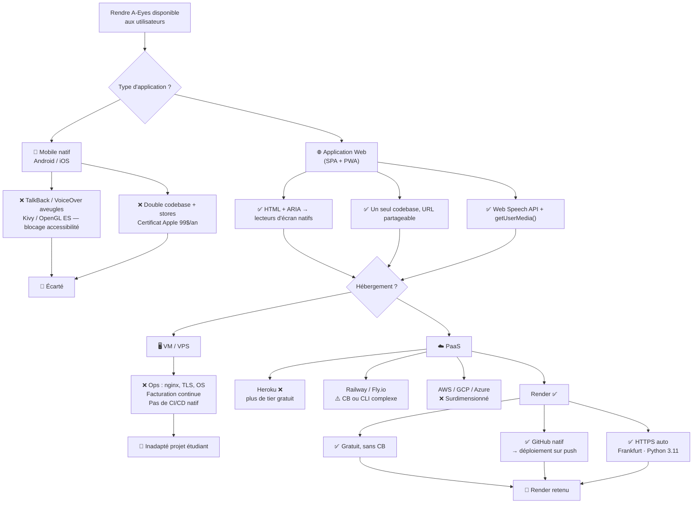

# A-Eyes — Pré-étude déploiement V1

> Projet étudiant / POC — les contraintes de budget nul, d'équipe réduite et d'absence de DevOps dédié ont guidé l'ensemble des choix. Ce document retrace le raisonnement qui a conduit aux deux décisions structurantes : application web plutôt que mobile natif, et Render comme plateforme d'hébergement.

---

## 1. Application mobile native vs application web

### Ce qui a été écarté

La V0 reposait sur Kivy + Buildozer (APK Android). Deux raisons ont conduit à abandonner cette voie pour la V1 :

- Accessibilité — Kivy rend son interface via OpenGL ES : du point de vue du système, l'écran est un rectangle opaque. TalkBack (Android) et VoiceOver (iOS) ne "voient" aucun composant natif, aucun bouton n'est annoncé. C'est un blocage direct sur l'objectif du projet (cf. [architecture_V0.md §1](../VO/architecture_V0.md)). La seule sortie aurait été d'écrire des bindings Java/Kotlin pour exposer des `ContentDescription` — hors scope pour un POC étudiant.
- Double codebase iOS — kivy-ios exige macOS, Xcode et un certificat Apple Developer (99 $/an). Maintenir deux chaînes de build (Android + iOS) pour une équipe étudiante sans budget n'est pas viable.

### Ce qui a été retenu : l'application web (SPA + PWA)

| Aspect | Décision |
|--------|----------|
| Accessibilité | HTML sémantique + attributs ARIA → TalkBack et VoiceOver fonctionnent nativement, sans aucun contournement |
| Caméra | `MediaDevices.getUserMedia()` — API navigateur, zéro dépendance système |
| TTS / STT | `SpeechSynthesis` + `SpeechRecognition` — Web Speech API, native dans Chrome/Edge/Safari |
| Distribution | URL partageable, aucun store, aucun APK — pertinent pour une démo académique |
| Mise à jour | Transparente à chaque ouverture du navigateur, sans soumission store |
| Installation mobile | PWA (manifest + service worker) → "Ajouter à l'écran d'accueil" si souhaité |
| Codebase | Un seul codebase pour Android, iOS et desktop |

---

## 2. VM vs PaaS

Une VM (OVH, EC2, Azure VM…) aurait donné un contrôle total mais imposé une charge opérationnelle incompatible avec un projet étudiant : configuration nginx/Caddy, gestion TLS, mises à jour OS, facturation à l'heure même sans trafic, et mise en place d'une pipeline CI/CD depuis zéro.

Un PaaS résout tous ces points : on pousse le code, la plateforme gère le build, le déploiement, le TLS et la disponibilité. C'est le seul modèle réaliste pour ce POC.

---

## 3. Choix de la plateforme PaaS : Render

| Plateforme | Tier gratuit | CB requise | Remarque |
|---|---|---|---|
| Heroku | Supprimé (nov. 2022) | Oui | Écarté — plus de tier gratuit |
| Railway | Oui (5 $/mois de crédit) | Non | Viable mais CB requise à terme |
| Fly.io | Oui (limité) | Oui (vérification) | CLI + TOML, courbe d'apprentissage |
| AWS / GCP / Azure | Free tier conditionnel | Oui | Surdimensionné, complexité IAM/VPC |
| Render | Oui (web service free) | Non | Retenu |

Render a été retenu pour les raisons suivantes :

- Tier gratuit permanent, sans carte bancaire — aucun risque de facturation inattendue
- Intégration GitHub native : Render se connecte directement au repo de travail de l'équipe et déclenche un déploiement automatique à chaque push, sans pipeline CI/CD à configurer
- HTTPS/TLS géré automatiquement, région Frankfurt (latence réduite pour les utilisateurs européens)
- Support natif Python 3.11 / uvicorn — pas de Dockerfile à écrire
- Configuration déclarative via `render.yaml`, versionnée dans le repo

```yaml
services:
  - type: web
    name: a-eyes
    runtime: python
    plan: free
    region: frankfurt
    rootDir: backend
    buildCommand: pip install -r requirements.txt
    startCommand: uvicorn main:app --host 0.0.0.0 --port $PORT
    envVars:
      - key: PYTHON_VERSION
        value: "3.11"
```

`$PORT` est injecté dynamiquement par Render — le processus ne fixe pas de port en dur, conformément à la pratique standard des PaaS.

---

## 4. Schéma de décision


