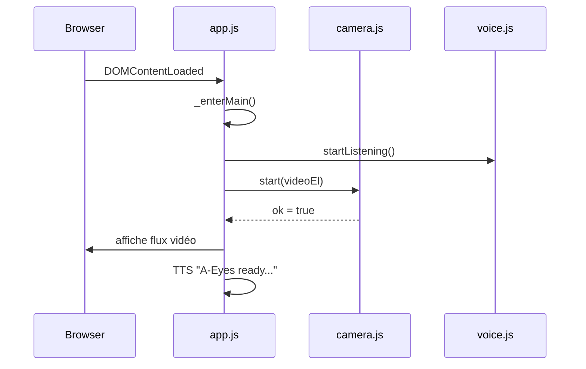
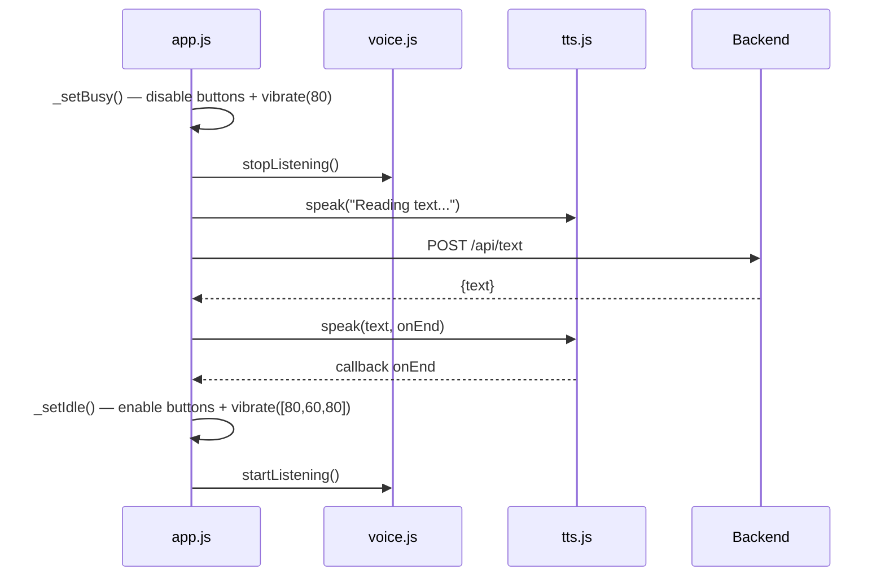

# Architecture V3 — A-Eyes

## Résumé des changements V3

La V3 introduit plusieurs évolutions par rapport à la V2 :

1. La caméra s'ouvre automatiquement au démarrage (suppression du bouton SCAN).
2. Ajout de la feature **Text** : lecture OCR du texte visible via `/api/text`.
3. Ajout de la feature **Details** : description détaillée de la dernière image via `/api/details`.
4. Suppression de l'écran Settings.
5. Anti-boucle vocale : arrêt complet de la reconnaissance vocale pendant tout traitement (`stopListening`/`startListening`).
6. Retour haptique : vibration courte au déclenchement, double vibration à la fin.
7. Désactivation des boutons d'action pendant tout traitement.

---

## Comparaison V2 → V3

| Aspect | V2 | V3 |
|--------|----|—--|
| Activation caméra | Bouton SCAN (toggle ON/OFF) | Automatique au chargement |
| Boutons | SCAN, DESCRIBE, REPEAT, SETTINGS | DESCRIBE, TEXT, DETAILS, ASK, REPEAT |
| Endpoints backend | `/api/describe` | `/api/describe` + `/api/text` + `/api/details` |
| Commandes vocales | scan, describe, repeat, settings, stop, help | describe, text, details, ask, repeat, stop, help |
| Prompt DESCRIBE | 2-3 phrases | 1 phrase, < 20 mots |
| Boucle vocale TTS | Non protégé | `stopListening`/`startListening` pendant tout traitement |
| Retour haptique | Absent | Vibration courte (début) / double vibration (fin) |
| Boutons | Toujours actifs | Désactivés pendant traitement |

---

## Architecture générale

```
┌──────────────────────────────────────────────────────┐
│  Navigateur (SPA)                                       │
│                                                        │
│  index.html  ──▶  app.js                               │
│                    ├── Camera (camera.js)               │
│                    ├── Speaker (tts.js)                 │
│                    └── VoiceListener (voice.js)         │
│                         │                              │
│                    POST /api/describe                   │
│                    POST /api/text                       │
│                    POST /api/details                    │
│                    POST /api/ask                        │
└──────────────────────────────────────────────────────┘
               │
               ▼  HTTP
┌──────────────────────────────────────────────────────┐
│  Backend FastAPI (backend/)                            │
│                                                        │
│  main.py                                               │
│   ├── api/describe.py  ──▶  /api/describe              │
│   ├── api/text.py      ──▶  /api/text                  │
│   ├── api/details.py   ──▶  /api/details               │
│   └── api/ask.py        ──▶  /api/ask                   │
│                                                        │
│  Tous les endpoints appellent GPT-4.1-mini (OpenAI)    │
└──────────────────────────────────────────────────────┘
```

---

## Flux V3 — Démarrage



---

## Flux V3 — Anti-boucle vocale



---

## Endpoints backend

### `POST /api/describe`

Capture → description globale (1 phrase, < 20 mots, max_tokens: 200).

### `POST /api/text`

Capture → lecture de tout le texte visible (OCR, max_tokens: 300).

### `POST /api/details`

`_lastFrame` → description précise (2-3 phrases, max_tokens: 500).

### `POST /api/ask`

`_lastFrame` + question + historique conversation → réponse contextuelle.

---

## Structure des fichiers V3

```
frontend/
  index.html          — DESCRIBE pleine largeur, TEXT+DETAILS+ASK sur même ligne
  css/style.css       — ajout .btn-details (#0a7a3e), suppression .btn-scan, .btn-settings, styles settings
  js/app.js           — caméra auto, onText(), onDetails(), ASK vocal, _setBusy()/_setIdle() (stopListening/startListening + vibration + désactivation boutons)
  js/voice.js         — ajout 'text', 'details' dans COMMANDS ; startListening()/stopListening()
  js/tts.js           — speak(text, onEnd) avec callback direct, u.onerror fallback Chrome, cancel(), repeat(onEnd)

backend/
  prompts.py          — tous les system prompts centralisés (DESCRIBE, DETAILS, TEXT, ASK)
  main.py             — routers text, details, ask
  api/describe.py     — endpoint /api/describe (importe DESCRIBE_PROMPT)
  api/text.py         — endpoint /api/text (importe TEXT_PROMPT)
  api/details.py      — endpoint /api/details (importe DETAILS_PROMPT)
  api/ask.py          — endpoint /api/ask (importe ASK_PROMPT)
```

---

## Lancement local

```bash
cd backend
uvicorn main:app --reload
```

Ouvrir [http://localhost:8000](http://localhost:8000) dans Chrome ou Edge (requis pour Web Speech API).
