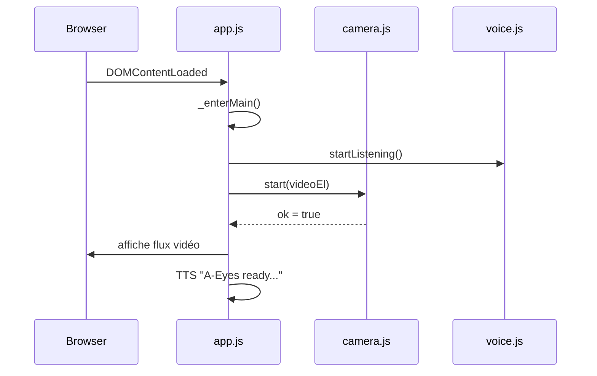
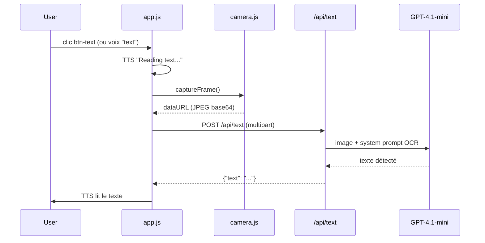

# Architecture V3 — A-Eyes

## Résumé des changements V3

La V3 introduit deux évolutions :

1. La caméra s'ouvre automatiquement au démarrage (suppression du bouton SCAN).
2. Ajout de la feature **Text** : lecture OCR du texte visible dans l'image via un nouvel endpoint `/api/text`.

---

## Comparaison V2 → V3

| Aspect | V2 | V3 |
|--------|----|----|
| Activation caméra | Bouton SCAN (toggle ON/OFF) | Automatique au chargement de l'écran principal |
| Boutons | SCAN, DESCRIBE, REPEAT, SETTINGS | DESCRIBE, TEXT, REPEAT, SETTINGS |
| Endpoints backend | `/api/describe` | `/api/describe` + `/api/text` |
| Commandes vocales | scan, describe, repeat, settings, stop, help | describe, text, repeat, settings, stop, help |

---

## Architecture générale (inchangée)

```
┌────────────────────────────────────────────────────────┐
│  Navigateur (SPA)                                      │
│                                                        │
│  index.html  ──▶  app.js                               │
│                    ├── Camera (camera.js)               │
│                    ├── Speaker (tts.js)                 │
│                    └── VoiceListener (voice.js)         │
│                         │                              │
│                    POST /api/describe                   │
│                    POST /api/text          ◀── V3 new   │
└────────────────────────────────────────────────────────┘
               │
               ▼  HTTP
┌────────────────────────────────────────────────────────┐
│  Backend FastAPI (backend/)                            │
│                                                        │
│  main.py                                               │
│   ├── api/describe.py  ──▶  /api/describe              │
│   └── api/text.py      ──▶  /api/text  ◀── V3 new      │
│                                                        │
│  Les deux endpoints appellent GPT-4.1-mini (OpenAI)   │
└────────────────────────────────────────────────────────┘
```

---

## Flux V3 — Démarrage



---

## Flux V3 — Feature Text (OCR)



---

## Endpoint `/api/text`

**Fichier** : `backend/api/text.py`

**Méthode** : `POST /api/text`

**Entrée** : `UploadFile` — frame JPEG

**System prompt** :
```
You are a text reading assistant for visually impaired people.
Read all visible text in this image exactly as it appears:
signs, labels, street names, prices, or any written words.
List them clearly.
If there is no text visible, respond with: No text detected in the image.
```

**Sortie** : `{"text": "..."}`

**Modèle** : `gpt-4.1-mini` — `max_tokens: 300` (plus élevé que `/describe` pour couvrir les listings de texte)

---

## Structure des fichiers V3

```
frontend/
  index.html          — suppression btn-scan, ajout btn-text
  css/style.css       — suppression .btn-scan, ajout .btn-text (#FF8C00)
  js/app.js           — caméra auto (_startCamera), onText(), commandes vocales
  js/voice.js         — retrait 'scan', ajout 'text' dans COMMANDS

backend/
  main.py             — inclusion router text
  api/text.py         — nouveau endpoint /api/text (OCR)
```

---

## Lancement local (inchangé)

```bash
cd backend
uvicorn main:app --reload
```

Ouvrir [http://localhost:8000](http://localhost:8000) dans Chrome ou Edge (requis pour Web Speech API).
