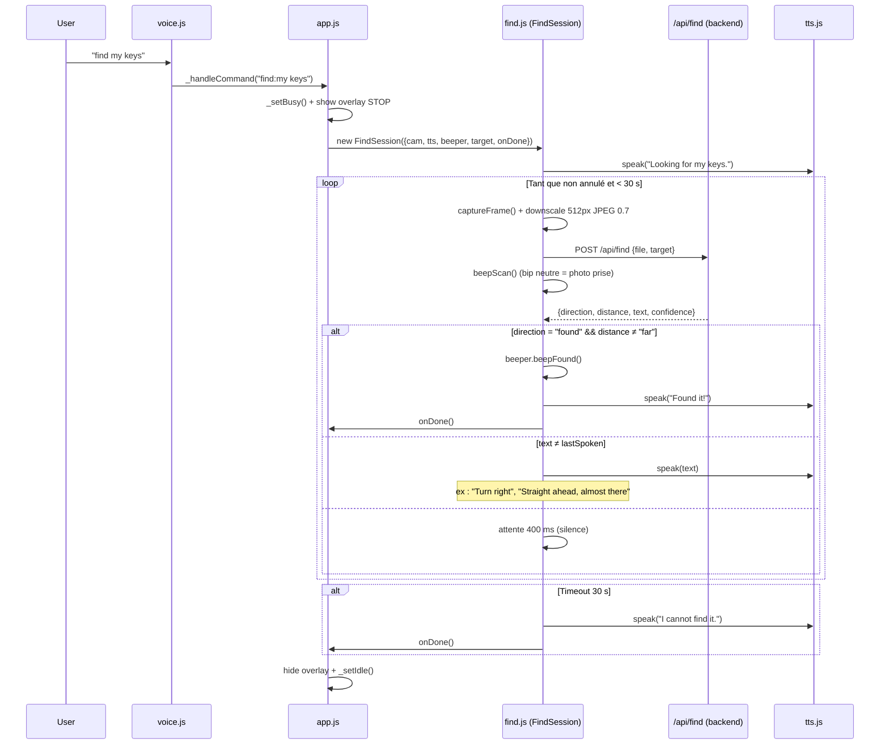

# Architecture V4 — A-Eyes

## Résumé des changements V4

La V4 introduit une nouvelle fonctionnalité de recherche guidée d'objets par la voix :

1. Nouveau mode **FIND** : l'utilisateur dit "find \<objet\>" et l'app guide en temps réel via des instructions vocales directionnelles ("Turn right", "Straight ahead, almost there", "Found it!").
2. Nouveau endpoint `POST /api/find` côté backend.
3. Nouveau module `find.js` côté frontend : classe `Beeper` (3 sons mono, onde carrée) + classe `FindSession` (boucle de guidage).
4. Commande vocale `find <target>` ajoutée dans `voice.js`.
5. Overlay STOP plein écran pendant une session FIND.
6. Init `AudioContext` au premier geste utilisateur (compatibilité iOS Safari).
7. Correction du bug CSS préexistant : sélecteur `.btn-repeat` manquant.
8. Suppression de l'affichage caméra : la `<video>` devient invisible (1×1 px) — les boutons occupent tout l'écran.

---

## Comparaison V3 → V4

| Aspect | V3 | V4 |
|--------|----|----|
| Commandes vocales | describe, text, details, ask, repeat, stop, help | + `find <target>` |
| Endpoints backend | `/api/describe`, `/api/text`, `/api/details`, `/api/ask` | + `/api/find` |
| Guidage objet | Absent | Instructions directionnelles vocales + bips mono |
| Retour audio | TTS uniquement | TTS + `Beeper` (found / lost / scan, onde carrée) |
| Overlay dédié | Absent | Overlay STOP plein écran pendant FIND |
| Modèle image | `detail` non spécifié | `detail: "low"` pour `/api/find` (latence réduite) |
| Format réponse IA | Texte libre | JSON strict (`direction`, `distance`, `text`, `confidence`) pour `/api/find` |
| Modules JS | `app.js`, `camera.js`, `tts.js`, `voice.js` | + `find.js` |
| Optimisation frame | JPEG 0.85, taille native | JPEG 0.7, downscale 512 px pour `/api/find` |
| Affichage caméra | Zone vidéo visible (flex: 1) | Supprimé — `<video>` invisible 1×1 px, boutons plein écran |

---

## Architecture générale

```
┌──────────────────────────────────────────────────────────┐
│  Navigateur (SPA)                                         │
│                                                           │
│  index.html  ──▶  app.js                                  │
│                    ├── Camera (camera.js)                  │
│                    ├── Speaker (tts.js)                    │
│                    ├── VoiceListener (voice.js)            │
│                    └── Beeper + FindSession (find.js)      │
│                         │                                 │
│                    POST /api/describe                      │
│                    POST /api/text                          │
│                    POST /api/details                       │
│                    POST /api/ask                           │
│                    POST /api/find        ← nouveau V4      │
└──────────────────────────────────────────────────────────┘
               │
               ▼  HTTP
┌──────────────────────────────────────────────────────────┐
│  Backend FastAPI (backend/)                               │
│                                                           │
│  main.py                                                  │
│   ├── api/describe.py  ──▶  /api/describe                 │
│   ├── api/text.py      ──▶  /api/text                     │
│   ├── api/details.py   ──▶  /api/details                  │
│   ├── api/ask.py       ──▶  /api/ask                      │
│   └── api/find.py      ──▶  /api/find     ← nouveau V4   │
│                                                           │
│  prompts.py : DESCRIBE_PROMPT, DETAILS_PROMPT,            │
│               TEXT_PROMPT, ASK_PROMPT, FIND_PROMPT        │
└──────────────────────────────────────────────────────────┘
```

---

## Flux V4 — Session FIND



---

## Schéma JSON — réponse de `/api/find`

```json
{
  "direction":  "right",
  "distance":   "mid",
  "text":       "Turn right",
  "confidence": 0.87
}
```

| Champ | Type | Valeurs possibles |
|-------|------|-------------------|
| `direction` | string | `left`, `right`, `forward`, `back`, `up`, `down`, `found`, `not_visible` |
| `distance` | string \| null | `close`, `mid`, `far`, `null` (quand `not_visible`) |
| `text` | string | Instruction ≤ 5 mots lue par TTS (ex. "Turn right", "Straight ahead, almost there") |
| `confidence` | number | 0.0 – 1.0 |

---

## Instructions directionnelles

Le champ `direction` correspond à l'action que l'utilisateur doit effectuer, depuis son point de vue :

| `direction` | Instruction TTS typique | Signification |
|-------------|------------------------|---------------|
| `left` | "Turn left" | L'objet est sur la gauche |
| `right` | "Turn right" | L'objet est sur la droite |
| `forward` + `mid` | "Straight ahead, keep going" | Droit devant, distance moyenne |
| `forward` + `close` | "Straight ahead, almost there" | Droit devant, presque à portée |
| `back` | "Behind you" | L'objet est derrière l'utilisateur |
| `up` | "Look up" | L'objet est au-dessus |
| `down` | "Look down" | L'objet est en dessous |
| `found` | "Found it!" | Centré et suffisamment proche |
| `not_visible` | "Not visible" | Objet hors champ |

---

## Modules frontend

### `find.js` — Beeper

Oscillateur de type `square` (onde carrée) — harmoniques riches, bien audible sur les petits haut-parleurs de téléphone.

```
Beeper
 ├── init()       — crée l'AudioContext (à appeler sur geste utilisateur)
 ├── resume()     — reprend le contexte suspendu (iOS Safari)
 ├── beepFound()  — 2 bips fixes : 880 Hz 120 ms, puis 1320 Hz 180 ms (succès)
 ├── beepLost()   — glissando 300→220 Hz 250 ms (objet hors champ)
 └── beepScan()   — 520 Hz 80 ms gain 0.15 (bip neutre = photo prise)
```

### `find.js` — FindSession

```
FindSession (constructor)
 ├── cancel()     — arrêt immédiat, TTS "Search cancelled."
 └── _loop()      — boucle asynchrone chaînée sur fin de TTS
      └── _downscale()  — canvas downscale 512 px, JPEG 0.7
```

---

## Endpoints backend

### `POST /api/find`

| Paramètre | Type | Description |
|-----------|------|-------------|
| `file` | UploadFile (JPEG) | Frame capturé depuis la caméra |
| `target` | string (Form) | Nom de l'objet à rechercher |

- Modèle : `gpt-4.1-mini`
- `detail: "low"` (~85 tokens d'image, latence réduite)
- `response_format: {"type": "json_object"}`
- `max_tokens: 80`
- Sanitisation serveur : `_sanitize()` garantit un JSON conforme même si le modèle dévie (fallback `direction="not_visible"`).
- Erreur OpenAI → HTTP 502 + `{"direction":"not_visible","distance":null,"text":"Search unavailable.","confidence":0.0}`.

---

## Compatibilité mobile

| Navigateur | TTS | Reconnaissance vocale | Bips (Web Audio) |
|------------|-----|----------------------|------------------|
| Chrome Android | ✅ | ✅ | ✅ |
| Safari iOS ≥ 14 | ✅ | ✅ | ✅ (après geste) |
| Firefox | ✅ | ❌ (dégradation — boutons OK) | ✅ |
