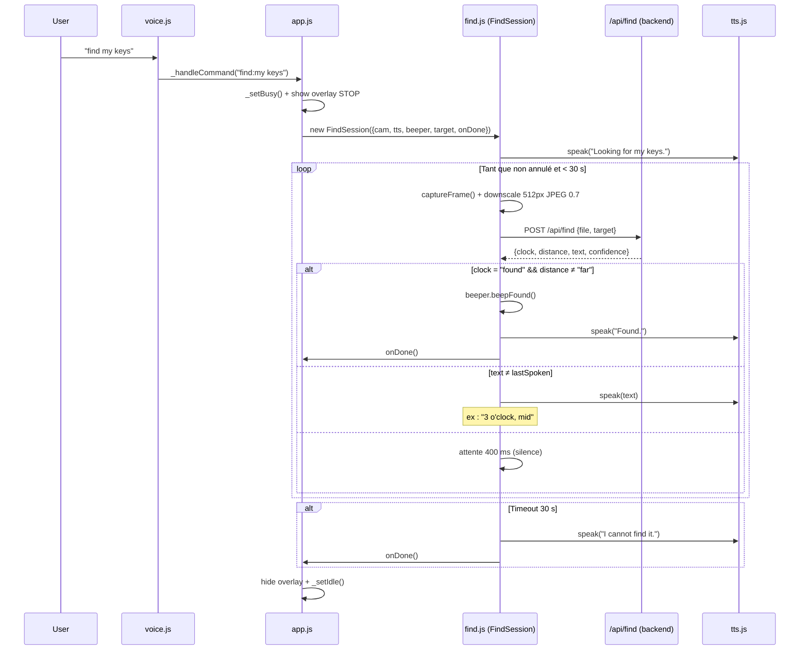

# Architecture V4 — A-Eyes

## Résumé des changements V4

La V4 introduit une nouvelle fonctionnalité de recherche guidée d'objets par la voix :

1. Nouveau mode **FIND** : l'utilisateur dit "find \<objet\>" et l'app guide en temps réel vers l'objet via une notation horloge vocale ("2 o'clock, close", "straight ahead", "found").
2. Nouveau endpoint `POST /api/find` côté backend.
3. Nouveau module `find.js` côté frontend : classe `Beeper` (2 sons mono) + classe `FindSession` (boucle de guidage).
4. Commande vocale `find <target>` ajoutée dans `voice.js`.
5. Overlay STOP plein écran pendant une session FIND.
6. Init `AudioContext` au premier geste utilisateur (compatibilité iOS Safari).
7. Correction du bug CSS préexistant : sélecteur `.btn-repeat` manquant.

---

## Comparaison V3 → V4

| Aspect | V3 | V4 |
|--------|----|----|
| Commandes vocales | describe, text, details, ask, repeat, stop, help | + `find <target>` |
| Endpoints backend | `/api/describe`, `/api/text`, `/api/details`, `/api/ask` | + `/api/find` |
| Guidage objet | Absent | Notation horloge vocale + bips mono |
| Retour audio | TTS uniquement | TTS + `Beeper` (found / lost) |
| Overlay dédié | Absent | Overlay STOP plein écran pendant FIND |
| Modèle image | `detail` non spécifié | `detail: "low"` pour `/api/find` (latence réduite) |
| Format réponse IA | Texte libre | JSON strict (`clock`, `distance`, `text`, `confidence`) pour `/api/find` |
| Modules JS | `app.js`, `camera.js`, `tts.js`, `voice.js` | + `find.js` |
| Optimisation frame | JPEG 0.85, taille native | JPEG 0.7, downscale 512 px pour `/api/find` |

---

## Architecture générale

```
┌──────────────────────────────────────────────────────────┐
│  Navigateur (SPA)                                         │
│                                                           │
│  index.html  ──▶  app.js                                  │
│                    ├── Camera (camera.js)                  │
│                    ├── Speaker (tts.js)                    │
│                    ├── VoiceListener (voice.js)            │
│                    └── Beeper + FindSession (find.js)      │
│                         │                                 │
│                    POST /api/describe                      │
│                    POST /api/text                          │
│                    POST /api/details                       │
│                    POST /api/ask                           │
│                    POST /api/find        ← nouveau V4      │
└──────────────────────────────────────────────────────────┘
               │
               ▼  HTTP
┌──────────────────────────────────────────────────────────┐
│  Backend FastAPI (backend/)                               │
│                                                           │
│  main.py                                                  │
│   ├── api/describe.py  ──▶  /api/describe                 │
│   ├── api/text.py      ──▶  /api/text                     │
│   ├── api/details.py   ──▶  /api/details                  │
│   ├── api/ask.py       ──▶  /api/ask                      │
│   └── api/find.py      ──▶  /api/find     ← nouveau V4   │
│                                                           │
│  prompts.py : DESCRIBE_PROMPT, DETAILS_PROMPT,            │
│               TEXT_PROMPT, ASK_PROMPT, FIND_PROMPT        │
└──────────────────────────────────────────────────────────┘
```

---

## Flux V4 — Session FIND



---

## Schéma JSON — réponse de `/api/find`

```json
{
  "clock":      "3",
  "distance":   "mid",
  "text":       "3 o'clock, mid",
  "confidence": 0.87
}
```

| Champ | Type | Valeurs possibles |
|-------|------|-------------------|
| `clock` | string | `"12"` à `"11"`, `"behind"`, `"found"`, `"lost"` |
| `distance` | string \| null | `"close"`, `"mid"`, `"far"`, `null` |
| `text` | string | Phrase courte ≤ 6 mots, lisible par TTS |
| `confidence` | number | 0.0 – 1.0 |

---

## Notation horloge

La notation horloge est interprétée depuis le point de vue de l'utilisateur qui tient le téléphone :

```
          12
     11        1
  10               2
  9       📷       3
  8               4
     7         5
          6
```

- `12` = droit devant
- `3` = à droite
- `9` = à gauche
- `6` = en bas (sol) / sous l'appareil
- `behind` = derrière l'utilisateur
- `found` = centré et assez proche pour être atteint
- `lost` = objet non visible dans le frame

---

## Modules frontend

### `find.js` — Beeper

```
Beeper
 ├── init()         — crée l'AudioContext (à appeler sur geste utilisateur)
 ├── resume()       — reprend le contexte suspendu (iOS Safari)
 ├── beepFound()    — double chirp ascendant 800→1200 Hz (succès)
 └── beepLost()     — ton grave 220→180 Hz (objet hors champ)
```

### `find.js` — FindSession

```
FindSession (constructor)
 ├── cancel()       — arrêt immédiat, TTS "Search cancelled."
 └── _loop()        — boucle asynchrone chaînée sur fin de TTS
      ├── _downscale()    — canvas downscale 512 px, JPEG 0.7
      └── _speakAndWait() — retourne une Promise résolue à la fin du TTS
```

---

## Endpoints backend

### `POST /api/find`

| Paramètre | Type | Description |
|-----------|------|-------------|
| `file` | UploadFile (JPEG) | Frame capturé depuis la caméra |
| `target` | string (Form) | Nom de l'objet à rechercher |

- Modèle : `gpt-4.1-mini`
- `detail: "low"` (~85 tokens d'image, latence réduite)
- `response_format: {"type": "json_object"}`
- `max_tokens: 80`
- Sanitisation serveur : `_sanitize()` garantit un JSON conforme même si le modèle dévie (fallback `clock="lost"`).
- Erreur OpenAI → HTTP 502 + `{"clock":"lost","distance":null,"text":"Search unavailable.","confidence":0.0}`.

---

## Compatibilité mobile

| Navigateur | TTS | Reconnaissance vocale | Bips (Web Audio) |
|------------|-----|----------------------|------------------|
| Chrome Android | ✅ | ✅ | ✅ |
| Safari iOS ≥ 14 | ✅ | ✅ | ✅ (après geste) |
| Firefox | ✅ | ❌ (dégradation — boutons OK) | ✅ |
