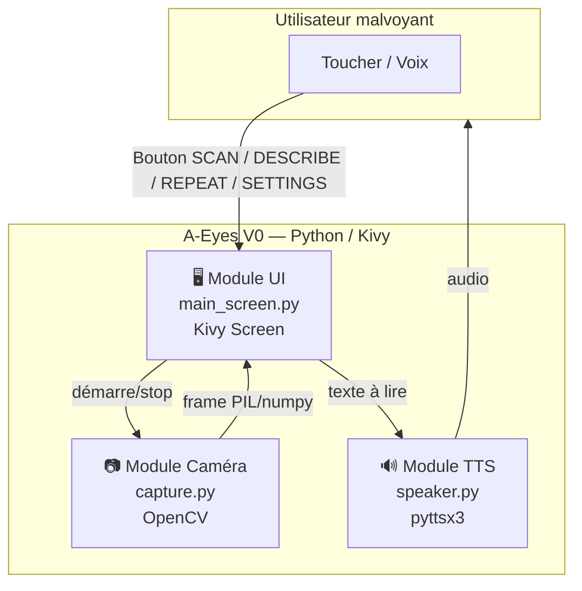
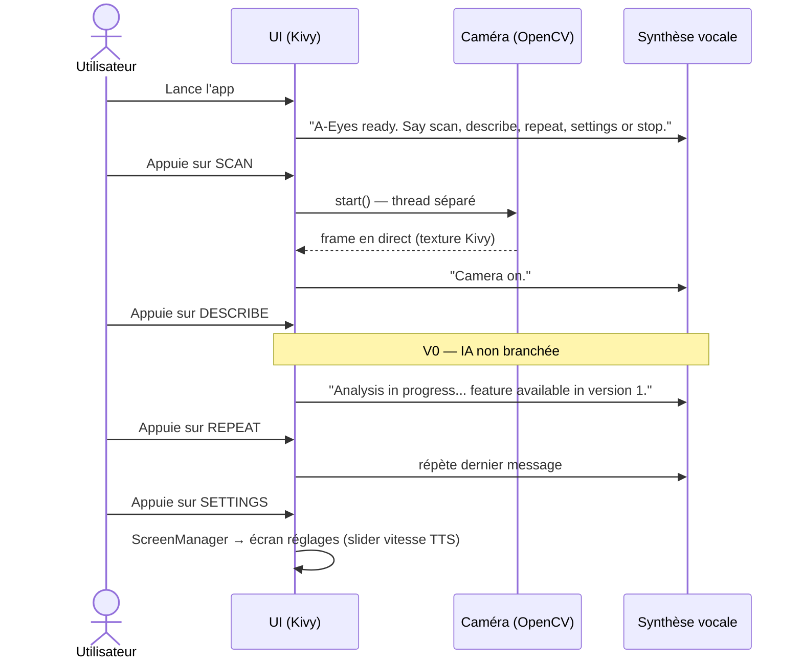
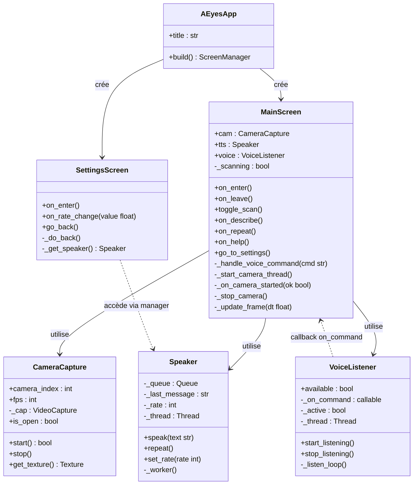

# A-Eyes — Architecture Prototype V0 (Squelette App)

> **Objectif V0** (réalisé le 08/04/2026) : ouvrir la caméra, afficher une UI accessible (gros boutons), navigation simple — aucune IA encore.

---

## 1. Choix technologique

| Besoin | Librairie | Justification |
|--------|-----------|---------------|
| Interface graphique | **Kivy** | Cross-platform (Android/iOS/Desktop), gros boutons natifs |
| Capture caméra | **OpenCV** (`cv2`) | Simple, bien documenté, compatible Kivy |
| Synthèse vocale (TTS) | **win32com** (`SAPI Windows`) | Natif Windows, plus stable que pyttsx3 (pas de conflits COM), contrôle fin de la vitesse via `SpVoice` |
| Commandes vocales (input) | **SpeechRecognition** + `pyaudio` + Google STT | Reconnaissance vocale via Google (nécessite internet) ; dégradation silencieuse si indisponible |
| Packaging Android | **Buildozer** | Génère l'APK depuis le code Kivy |

> Pour iOS : remplacer Buildozer par **kivy-ios** (toolchain Apple).

> **⚠️ Limite Kivy sur VoiceOver/TalkBack — explication détaillée**
>
> **Pourquoi ça ne fonctionne pas ?**
> TalkBack (Android) et VoiceOver (iOS) sont des services d'accessibilité fournis par le système d'exploitation. Ils fonctionnent en lisant l'arbre de composants natifs de l'interface (`View` Android / `UIAccessibilityElement` iOS). Kivy dessine son interface **entièrement via OpenGL ES** dans un seul canvas — il ne produit **aucun composant UI natif**. Du point de vue du système, l'écran Kivy est un rectangle opaque sans sémantique : TalkBack/VoiceOver ne "voient" donc rien à lire.
>
> **Concrètement pour l'utilisateur :**
> - Activer TalkBack sur Android et parcourir l'app A-Eyes → silence total, aucun bouton annoncé.
> - Le lecteur d'écran ne peut pas décrire "bouton SCAN", "bouton RÉPÉTER", etc.
>
> **Contournement choisi en V0 :**
> On simule le comportement attendu via `pyttsx3` : chaque bouton déclenche **immédiatement** une annonce vocale au toucher (`on_press`). L'utilisateur reçoit le même retour audio — mais c'est l'app qui gère le TTS, pas le système. Cela couvre le critère de validation p.7 ("interface accessible") pour le prototype.
>
> **Limite de ce contournement :**
> - Ne fonctionne pas si l'utilisateur a TalkBack déjà actif (double lecture, conflits audio).
> - Pas conforme aux standards d'accessibilité (WCAG 4.1.2 — Name, Role, Value).
>
> **Plan pour V1+ :**
> Deux options selon les ressources :
> 1. **Binding Java/Kotlin (Android)** — écrire un plugin Kivy qui expose les `ContentDescription` Android pour chaque widget → TalkBack reçoit les labels.
> 2. **Migration partielle vers Flutter ou React Native** — ces frameworks génèrent des widgets natifs et supportent TalkBack/VoiceOver nativement sans effort supplémentaire.

---

## 2. Contraintes non-fonctionnelles V0

| Contrainte (PDF) | Prise en compte dans V0 |
|---|---|
| Compatibilité iOS **et** Android (p.6) | Kivy + Buildozer (Android) / kivy-ios (iOS) |
| RGPD — anonymisation (p.6) | V0 ne stocke **aucune donnée** : les frames restent en RAM, aucun fichier écrit, aucun envoi réseau |
| Temps de réponse IA < 1s (p.6) | Hors scope V0 (pas d'IA). À mesurer en V1 |
| Précision > 85% (p.6) | Hors scope V0. À mesurer en V1 |
| Public 50+ / seniors (p.4) | Gros boutons ≥ 90dp, fort contraste, TTS à chaque action |
| Baisse de contraste chez utilisateurs (p.5) | Fond noir + boutons jaune/bleu vif (ratio WCAG ≥ 4.5:1) |

---

## 3. Architecture générale



---

## 4. Flux d'utilisation V0 (séquence)



---

## 5. Structure des fichiers

```
a_eyes/
├── main.py              # Point d'entrée — lance l'app Kivy
├── a_eyes.kv            # Styles et layout Kivy (déclaratif)
│
├── ui/
│   ├── __init__.py
│   ├── main_screen.py   # Écran principal (Scan / Décrire / Répéter / Réglages)
│   └── settings_screen.py  # Écran réglages (volume, vitesse TTS)
│
├── camera/
│   ├── __init__.py
│   └── capture.py       # Gestion flux caméra (OpenCV → Kivy Texture)
│
├── tts/
│   ├── __init__.py
│   └── speaker.py       # Wrapper pyttsx3 (speak, stop, config)
│
├── voice_input/
│   ├── __init__.py
│   └── listener.py      # Commandes vocales (SpeechRecognition)
│
├── config.py            # Constantes globales (couleurs, tailles, langue)
└── buildozer.spec       # Config packaging Android
```

---

## 6. Code squelette

### `main.py`
```python
import os
import sys
import logging

logging.getLogger("comtypes").setLevel(logging.WARNING)

sys.path.insert(0, os.path.dirname(__file__))

from kivy.app import App
from kivy.lang import Builder
from kivy.uix.screenmanager import ScreenManager, FadeTransition

from ui.main_screen import MainScreen
from ui.settings_screen import SettingsScreen

Builder.load_file(os.path.join(os.path.dirname(__file__), "a_eyes.kv"))


class AEyesApp(App):
    title = "A-Eyes"

    def build(self):
        sm = ScreenManager(transition=FadeTransition())
        sm.add_widget(MainScreen(name="main"))
        sm.add_widget(SettingsScreen(name="settings"))
        return sm


if __name__ == "__main__":
    AEyesApp().run()
```

---

### `config.py`
```python
# ── Couleurs (fort contraste pour malvoyants) — RGBA normalisé ────────────────
BG_COLOR        = (0, 0, 0, 1)          # Fond noir
BTN_SCAN_COLOR  = (1, 0.8, 0, 1)        # Bouton SCAN : jaune vif
BTN_DESC_COLOR  = (0.1, 0.7, 0.3, 1)   # Bouton DESCRIBE : vert
BTN_REP_COLOR   = (0.2, 0.6, 1, 1)     # Bouton REPEAT : bleu
BTN_SET_COLOR   = (0.3, 0.3, 0.3, 1)   # Bouton SETTINGS : gris neutre
BTN_DARK_TEXT   = (0, 0, 0, 1)         # Texte noir (sur fond jaune)
BTN_LIGHT_TEXT  = (1, 1, 1, 1)         # Texte blanc (sur fond bleu/vert/gris)

# ── Typographie (sp = scale-independent pixels) ───────────────────────────────
FONT_SIZE_XL = "36sp"   # Titres principaux
FONT_SIZE_L  = "32sp"   # Boutons principaux
FONT_SIZE_M  = "26sp"   # Contenu courant
FONT_SIZE_S  = "22sp"   # Éléments secondaires

# ── Tailles boutons (dp = density-independent pixels) ─────────────────────────
BTN_HEIGHT_XL = "110dp"  # Bouton SCAN (prioritaire)
BTN_HEIGHT_L  = "95dp"
BTN_HEIGHT_M  = "80dp"
BTN_HEIGHT_S  = "65dp"
PADDING       = "18dp"
SPACING       = "12dp"

# ── TTS ───────────────────────────────────────────────────────────────────────
TTS_RATE_DEFAULT = 160   # Vitesse par défaut (mots/min)
TTS_RATE_MIN     = 80
TTS_RATE_MAX     = 250
TTS_LANG         = "en"  # Langue de la synthèse vocale (anglais)

# ── Caméra ────────────────────────────────────────────────────────────────────
CAMERA_FPS   = 30
CAMERA_INDEX = 0  # 0 = caméra principale du système

# ── Message stub DESCRIBE (V0 — IA non connectée) ─────────────────────────────
DESCRIBE_STUB_MSG = "Analysis in progress... feature available in version 1."
```

---

### `voice_input/listener.py` (commandes vocales)
```python
import threading

try:
    import speech_recognition as sr
    SR_AVAILABLE = True
except ImportError:
    SR_AVAILABLE = False   # Dégradation silencieuse : app 100% fonctionnelle sans micro

# Mots-clés anglais → identifiant de commande
COMMANDS = {
    "scan":      "scan",       # Démarre/arrête la caméra
    "describe":  "describe",   # Analyse la scène (IA, V1)
    "repeat":    "repeat",     # Relit le dernier message
    "settings":  "settings",   # Navigue vers les réglages
    "help":      "help",       # Lit la liste des commandes
    "stop":      "stop",       # Arrête la caméra
}


class VoiceListener:
    """Écoute en continu (Google STT — nécessite internet) et appelle on_command."""

    def __init__(self, on_command):
        self._on_command = on_command
        self._active = False
        self._thread = None
        self.available = SR_AVAILABLE

    def start_listening(self):
        if not self.available:
            return  # Pas de SpeechRecognition installé
        self._active = True
        self._thread = threading.Thread(target=self._listen_loop, daemon=True)
        self._thread.start()

    def stop_listening(self):
        self._active = False

    def _listen_loop(self):
        recognizer = sr.Recognizer()
        with sr.Microphone() as source:
            recognizer.adjust_for_ambient_noise(source, duration=0.5)
            while self._active:
                try:
                    audio = recognizer.listen(source, timeout=5, phrase_time_limit=4)
                    text = recognizer.recognize_google(audio, language="en-US").lower()
                    for keyword, cmd in COMMANDS.items():
                        if keyword in text:
                            self._on_command(cmd)
                            break
                except Exception:
                    pass  # Timeout, réseau absent, micro inaccessible — on continue
```

---

### `tts/speaker.py`
```python
import queue
import threading
import pythoncom
import win32com.client
from config import TTS_RATE_DEFAULT

_STOP = object()


class Speaker:
    """Synthèse vocale asynchrone via SAPI Windows (win32com). Non bloquant."""

    def __init__(self):
        self._queue = queue.Queue()
        self._last_message = ""
        self._rate = TTS_RATE_DEFAULT
        self._thread = threading.Thread(target=self._worker, daemon=True)
        self._thread.start()

    def speak(self, text: str):
        self._last_message = text
        self._queue.put(text)

    def repeat(self):
        if self._last_message:
            self._queue.put(self._last_message)

    def set_rate(self, rate: int):
        self._rate = rate

    def _worker(self):
        pythoncom.CoInitialize()
        voice = win32com.client.Dispatch("SAPI.SpVoice")
        while True:
            item = self._queue.get()
            if item is _STOP:
                break
            voice.Rate = self._rate
            voice.Speak(item)
```

---

### `camera/capture.py`
```python
import cv2
import threading
from kivy.graphics.texture import Texture


class CameraCapture:
    def __init__(self, camera_index: int = 0, fps: int = 30):
        self.camera_index = camera_index
        self.fps = fps
        self._cap = None

    def start(self) -> bool:
        """Ouverture robuste : tente DirectShow (Windows) puis backend par défaut."""
        result = [False]

        def _try_open(backend):
            try:
                cap = cv2.VideoCapture(self.camera_index, backend)
                if cap.isOpened():
                    self._cap = cap
                    result[0] = True
            except Exception:
                pass

        for backend in (cv2.CAP_DSHOW, cv2.CAP_ANY):
            t = threading.Thread(target=_try_open, args=(backend,), daemon=True)
            t.start()
            t.join(timeout=4)
            if result[0]:
                break
        return result[0]

    def stop(self):
        if self._cap:
            self._cap.release()
            self._cap = None

    def get_texture(self):
        if not self._cap:
            return None
        ret, frame = self._cap.read()
        if not ret:
            return None
        frame = cv2.flip(frame, 0)   # Kivy : origine en bas à gauche
        buf = frame.tobytes()
        texture = Texture.create(size=(frame.shape[1], frame.shape[0]), colorfmt="bgr")
        texture.blit_buffer(buf, colorfmt="bgr", bufferfmt="ubyte")
        return texture
```

---

### `ui/main_screen.py`
```python
from kivy.uix.screenmanager import Screen
from kivy.clock import Clock
import threading

from camera.capture import CameraCapture
from tts.speaker import Speaker
from voice_input.listener import VoiceListener
from config import CAMERA_INDEX, CAMERA_FPS, DESCRIBE_STUB_MSG


class MainScreen(Screen):
    def __init__(self, **kwargs):
        super().__init__(**kwargs)
        self.cam = CameraCapture(camera_index=CAMERA_INDEX, fps=CAMERA_FPS)
        self.tts = Speaker()
        self.voice = VoiceListener(on_command=self._handle_voice_command)
        self._scanning = False

    def on_enter(self):
        self.tts.speak("A-Eyes ready. Say scan, describe, repeat, settings or stop.")
        self.voice.start_listening()

    def on_leave(self):
        self._stop_camera()
        self.voice.stop_listening()

    def toggle_scan(self):
        if not self._scanning:
            self.tts.speak("Starting camera...")
            threading.Thread(target=self._start_camera_thread, daemon=True).start()
        else:
            self._stop_camera()
            self.tts.speak("Camera off.")

    def _start_camera_thread(self):
        ok = self.cam.start()
        Clock.schedule_once(lambda dt: self._on_camera_started(ok), 0)

    def _on_camera_started(self, ok: bool):
        if ok:
            self._scanning = True
            Clock.schedule_interval(self._update_frame, 1 / CAMERA_FPS)
            self.tts.speak("Camera on.")
        else:
            self.tts.speak("Camera unavailable.")

    def _update_frame(self, dt):
        texture = self.cam.get_texture()
        if texture:
            self.ids.camera_view.texture = texture

    def _stop_camera(self):
        Clock.unschedule(self._update_frame)
        self.cam.stop()
        self._scanning = False

    def on_describe(self):
        self.tts.speak(DESCRIBE_STUB_MSG)

    def on_repeat(self):
        self.tts.repeat()

    def go_to_settings(self):
        self.manager.current = "settings"

    def _handle_voice_command(self, cmd: str):
        Clock.schedule_once(lambda dt: self._dispatch_command(cmd), 0)

    def _dispatch_command(self, cmd: str):
        {"scan": self.toggle_scan, "describe": self.on_describe,
         "repeat": self.on_repeat, "settings": self.go_to_settings,
         "stop": self._stop_camera}.get(cmd, lambda: None)()
```

---

### `a_eyes.kv` (layout accessible)
```kivy
#:kivy 2.3

<Button>:
    font_size: "30sp"
    bold: True

<MainScreen>:
    name: "main"
    canvas.before:
        Color:
            rgba: 0, 0, 0, 1        # Fond noir
        Rectangle:
            pos: self.pos
            size: self.size

    BoxLayout:
        orientation: "vertical"
        padding: "18dp"
        spacing: "12dp"

        Image:
            id: camera_view
            size_hint: (1, 0.50)
            fit_mode: "contain"

        Button:
            text: "SCAN"
            font_size: "36sp"
            size_hint: (1, None)
            height: "110dp"
            background_color: 1, 0.8, 0, 1   # Jaune — fort contraste
            color: 0, 0, 0, 1
            on_press: root.toggle_scan()

        Button:
            text: "DESCRIBE"
            font_size: "32sp"
            size_hint: (1, None)
            height: "95dp"
            background_color: 0.1, 0.7, 0.3, 1   # Vert
            color: 1, 1, 1, 1
            on_press: root.on_describe()

        Button:
            text: "REPEAT"
            font_size: "26sp"
            size_hint: (1, None)
            height: "80dp"
            background_color: 0.2, 0.6, 1, 1   # Bleu
            color: 1, 1, 1, 1
            on_press: root.on_repeat()

        Button:
            text: "SETTINGS"
            font_size: "22sp"
            size_hint: (1, None)
            height: "65dp"
            background_color: 0.3, 0.3, 0.3, 1
            color: 1, 1, 1, 1
            on_press: root.go_to_settings()
```

---

## 7. Critères de validation V0 (checklist)

| Critère (page 7) | Comment le vérifier |
|---|---|
| ✅ Ouverture de la caméra | `cap.read()` retourne `True` + frame visible à l'écran |
| ✅ Interface accessible | Boutons ≥ 90dp, contraste ≥ 4.5:1 (WCAG AA) |
| ✅ Navigation simple (4 boutons) | SCAN / DESCRIBE / REPEAT / SETTINGS tous fonctionnels |
| ✅ Bouton DESCRIBE câblé (stub V0) | Retourne `DESCRIBE_STUB_MSG`, prêt pour branchement IA en V1 |
| ✅ Commandes vocales | `VoiceListener` reconnaît "scan", "describe", "repeat", "settings", "help", "stop" (en-US, Google STT) |
| ✅ Dégradation vocale silencieuse | App 100% fonctionnelle par boutons si SpeechRecognition absent ou hors ligne |
| ✅ Utilisable par un malvoyant | Feedback TTS à chaque action via SAPI Windows, 0 menu caché |
| ✅ RGPD | Aucune donnée persistée ou transmise en V0 |
| ⚠️ VoiceOver/TalkBack natif | Non supporté par Kivy → remplacé par TTS SAPI, à adresser post-V1 |
| ⚠️ Plan B si UX inadaptée | UI `"Scan / Répéter / Réglages"` uniquement (déjà la structure proposée) |

---

## 8. Installation rapide

```bash
pip install kivy opencv-python pywin32 SpeechRecognition pyaudio

# Lancer en local (desktop Windows)
cd a_eyes
python main.py

# Générer l'APK Android (une fois le V0 validé)
pip install buildozer
buildozer android debug
```

> **Note Windows** : `win32com` (SAPI) est fourni par le paquet `pywin32`. `pyttsx3` est conservé dans `requirements.txt` pour compatibilité future multi-plateformes mais n'est pas utilisé en V0.

---

## 9. Dépendances résumées

```
kivy>=2.3
opencv-python>=4.9
pywin32>=306          # win32com / SAPI Windows (TTS)
pyttsx3>=2.90         # conservé pour future portabilité non-Windows
SpeechRecognition>=3.10
pyaudio>=0.2.14
# buildozer>=1.5      # Android uniquement
```

---

> **Note V0** : pas d'IA, pas de modèle de détection. Le seul objectif est de valider la boucle `caméra → UI → voix`. L'IA (YOLO, MobileNet…) sera branchée en V1.

---

## 11. Problème rencontré — Synthèse vocale silencieuse sur les boutons

### Symptôme
Au lancement, la voix prononçait correctement le message de démarrage *"Application A-Eyes prête"*. Mais les boutons **DÉCRIRE** et **RÉPÉTER** ne produisaient aucun son malgré un clic confirmé.

### Cause racine — `pyttsx3` + thread secondaire sur Windows

La première implémentation de `Speaker` utilisait `pyttsx3` avec un `threading.Lock` :

```python
# ❌ Version initiale — bug silencieux
class Speaker:
    def speak(self, text):
        t = threading.Thread(target=self._run, args=(text,), daemon=True)
        t.start()

    def _run(self, text):
        with self._lock:           # ← bloque ici si un thread précédent tourne encore
            self.engine.say(text)
            self.engine.runAndWait()
```

**Problème 1 — Lock bloquant** : le message de démarrage tenait le verrou pendant toute sa durée (`runAndWait`). Les clics suivants attendaient indéfiniment derrière — silence total sans erreur.

**Problème 2 — `pyttsx3.runAndWait()` dans un thread secondaire** : sur Windows, `pyttsx3` utilise COM (SAPI). COM exige que l'objet soit initialisé et utilisé dans le **même thread**. Or `pyttsx3.init()` était appelé dans le thread principal, et `runAndWait()` depuis un thread secondaire → COM ignorait silencieusement la demande.

### Tentative intermédiaire — queue + thread dédié pyttsx3

```python
# ⚠️ Mieux, mais runAndWait() retourne quand même immédiatement en thread secondaire
def _worker(self):
    engine = pyttsx3.init()   # init dans le bon thread ✓
    while True:
        text = self._queue.get()
        engine.say(text)
        engine.runAndWait()   # ← retourne instantanément sur Windows en thread secondaire ✗
```

Diagnostiqué via un test d'isolation : le script se terminait en 0 seconde au lieu de 12.

### Solution finale — SAPI direct via `win32com`

`pyttsx3` est abandonné au profit de **`win32com.client.Dispatch("SAPI.SpVoice")`** (fourni par `pywin32`, déjà installé comme dépendance de `pyttsx3`).

```python
# ✅ Version finale — SAPI dans un thread dédié avec CoInitialize
def _worker(self):
    pythoncom.CoInitialize()          # obligatoire pour COM en thread secondaire
    voice = win32com.client.Dispatch("SAPI.SpVoice")
    while True:
        text = self._queue.get()
        voice.Speak(text)             # bloquant ✓, COM-safe ✓
    pythoncom.CoUninitialize()
```

`voice.Speak(text)` est **bloquant** dans le thread secondaire et ne retourne qu'une fois la parole terminée. La queue garantit que les messages s'enchaînent sans se perdre, et `speak()` reste non-bloquant pour l'UI Kivy.

### Leçon retenue

> Sur Windows, `pyttsx3` ne fonctionne **pas** de manière fiable depuis un thread secondaire. Utiliser directement `win32com` + `pythoncom.CoInitialize()` est la solution robuste pour tout projet Python/Windows nécessitant du TTS dans un thread dédié.

---

## 12. Problème rencontré — Prononciation française incorrecte

### Symptôme
La voix synthétique prononçait le texte français avec un accent anglais (lettres accentuées massacrées, intonation anglophone).

### Cause
SAPI sélectionne la voix **système par défaut**, souvent une voix anglaise sur Windows non configuré pour le français. Il n'y a pas de détection automatique de la langue du texte.

### Solution — Sélection explicite d'une voix française par LCID

SAPI identifie les langues par un **LCID** (code hexadécimal) :

| Code | Langue |
|------|--------|
| `040C` | Français — France |
| `080C` | Français — Belgique |
| `100C` | Français — Suisse |

Dans `_worker()`, on parcourt les voix installées et on sélectionne la première voix FR disponible :

```python
tokens = voice.GetVoices()
fr_voice = None
for i in range(tokens.Count):
    tok = tokens.Item(i)
    try:
        lang = tok.GetAttribute("Language")
        desc = tok.GetDescription().lower()
        if lang.lower() in ("040c", "080c", "100c") or "french" in desc or "français" in desc:
            fr_voice = tok
            break
    except Exception:
        pass
if fr_voice:
    voice.Voice = fr_voice
else:
    print("[TTS] Pas de voix FR installée — voix par défaut")
```

### Prérequis — Installer une voix française Windows

Si aucune voix FR n'est trouvée, il faut l'installer sur le PC :

- **Windows 11** : Paramètres → Heure et langue → Parole → Ajouter des voix → `Français (France)` → installe **Microsoft Paul** ou **Microsoft Hortense**
- **Windows 10** : Paramètres → Région/Langue → Ajouter une langue → Français → cocher "Synthèse vocale"

Après installation, relancer l'app — le terminal affiche `[TTS] Voix FR : Microsoft Paul` pour confirmer.

### Leçon retenue

> Ne pas supposer que la voix par défaut est dans la bonne langue. Toujours sélectionner explicitement la voix par LCID dès le démarrage, et logger le nom de la voix active pour faciliter le débogage.

---

## 10. Scénario de démonstration V0

**Contexte** : Ahmed, 58 ans, malvoyant (vision périphérique réduite). Il lance l'app A-Eyes sur son téléphone posé sur une table.

---

**1 — Lancement**
Ahmed appuie sur l'icône de l'app. L'écran s'affiche : fond noir, trois gros boutons colorés. Immédiatement, une voix synthétique dit :
> *"Application A-Eyes prête. Appuyez sur Scan."*

Il n'a pas besoin de lire l'écran. Il sait déjà quoi faire.

---

**2 — Activation de la caméra**
Ahmed appuie sur le grand bouton jaune **SCAN**. La voix dit :
> *"Caméra activée."*

Le flux vidéo s'affiche dans la partie haute de l'écran. Pour l'instant en V0, aucune détection — juste l'image en direct. Ahmed pointe son téléphone vers la rue devant lui.

---

**3 — Il demande une description**
Ahmed pointe le téléphone vers la rue et appuie sur le bouton vert **DÉCRIRE**. La voix répond :
> *"Analyse en cours... fonctionnalité disponible en V1."*

Il comprend que le squelette est là — l'IA sera branchée à la prochaine itération. Le bouton est déjà câblé, il suffit de remplacer le message par le vrai appel au modèle en V1.

---

**4 — Il n'a pas entendu le message**
Le bruit ambiant était fort. Ahmed appuie sur le bouton bleu **RÉPÉTER**. La voix répète :
> *"Analyse en cours... fonctionnalité disponible en V1."*

---

**4 — Commande vocale (alternative aux boutons)**
Ahmed préfère ne pas manipuler l'écran en marchant. Il dit à voix haute :
> *"Scan"*

L'app reconnaît le mot et déclenche la même action que le bouton — la voix confirme :
> *"Caméra activée."*

---

**5 — Réglages**
Ahmed trouve la voix trop rapide. Il appuie sur **RÉGLAGES**. L'écran change, une voix dit :
> *"Écran réglages. Vitesse, volume."*

Il réduit la vitesse de parole avec un gros slider, puis revient. La voix confirme :
> *"Réglages sauvegardés."*

---

**6 — Fin de démo**
Ahmed dit :
> *"Arrêter"*

La caméra coupe. La voix dit :
> *"Caméra arrêtée."*

---

**Ce que valide cette démo pour V0 (critères page 7)**

| Critère | Validé ? |
|---|---|
| Caméra s'ouvre et se ferme | ✅ |
| Chaque action donne un retour vocal immédiat | ✅ |
| Navigation possible avec les 3 boutons | ✅ |
| Navigation possible par commande vocale | ✅ |
| Utilisable sans regarder l'écran | ✅ |

> **Ce qui n'est pas encore là (V1)** : Ahmed ne reçoit aucune description de ce que la caméra voit. En V1, après "Caméra activée", la voix commencerait à dire *"Chaise à 1 mètre, porte à droite"*.


---

## 13. Modèle de classes

### Diagramme UML



---

### Documentation des classes

#### `AEyesApp` — `main.py`

Classe racine de l'application Kivy. Hérite de `kivy.app.App`.

| Élément | Type | Description |
|---|---|---|
| `title` | `str` | Titre affiché dans la barre de fenêtre desktop |
| `build()` | `ScreenManager` | Construit et retourne le widget racine ; crée le `ScreenManager` avec transition en fondu, puis y ajoute `MainScreen` et `SettingsScreen` |

> **Cycle de vie Kivy** : `build()` est appelé automatiquement une seule fois au démarrage, avant l'affichage du premier écran.

---

#### `MainScreen` — `ui/main_screen.py`

Écran principal de l'application. Hérite de `kivy.uix.screenmanager.Screen`.  
Coordonne les trois composants fonctionnels : caméra, TTS et écoute vocale.

| Attribut | Type | Description |
|---|---|---|
| `cam` | `CameraCapture` | Instance du gestionnaire de flux vidéo |
| `tts` | `Speaker` | Instance du moteur de synthèse vocale |
| `voice` | `VoiceListener` | Instance du reconnaisseur vocal |
| `_scanning` | `bool` | `True` si le flux caméra est actif |

| Méthode | Signature | Description |
|---|---|---|
| `on_enter()` | `-> None` | Appelé par Kivy à l'affichage ; lit le message d'accueil et démarre l'écoute vocale |
| `on_leave()` | `-> None` | Appelé par Kivy au départ ; coupe la caméra et arrête l'écoute vocale |
| `toggle_scan()` | `-> None` | Bascule le flux caméra ON/OFF ; lance l'ouverture dans un thread secondaire |
| `on_describe()` | `-> None` | Lit le message de substitution (V0) ; en V1 : appel au modèle IA |
| `on_repeat()` | `-> None` | Rejoue le dernier message TTS |
| `on_help()` | `-> None` | Lit la liste des commandes disponibles |
| `go_to_settings()` | `-> None` | Navigue vers l'écran `SettingsScreen` |
| `_handle_voice_command(cmd)` | `str -> None` | Callback du `VoiceListener` ; dispatche la commande vers la méthode correspondante via `Clock.schedule_once` |
| `_start_camera_thread()` | `-> None` | Exécuté en thread secondaire ; appelle `cam.start()` puis repasse dans le thread Kivy |
| `_on_camera_started(ok)` | `bool -> None` | Exécuté dans le thread Kivy ; active ou non le rafraîchissement des frames |
| `_stop_camera()` | `-> None` | Déprogramme `_update_frame`, libère la caméra, remet `_scanning` à `False` |
| `_update_frame(dt)` | `float -> None` | Appelé ~30×/s par l'horloge Kivy ; récupère la texture et met à jour le widget `camera_view` |

---

#### `SettingsScreen` — `ui/settings_screen.py`

Écran de réglages. Hérite de `kivy.uix.screenmanager.Screen`.  
Permet à l'utilisateur d'ajuster la vitesse de parole via un slider.

| Méthode | Signature | Description |
|---|---|---|
| `on_enter()` | `-> None` | Annonce l'écran vocalement et initialise le slider à `TTS_RATE_DEFAULT` |
| `on_rate_change(value)` | `float -> None` | Appelé à chaque mouvement du slider ; applique la vitesse au `Speaker` |
| `go_back()` | `-> None` | Lit "Réglages sauvegardés" puis attend 0,8 s avant de revenir à `MainScreen` |
| `_do_back()` | `-> None` | Effectue la navigation `manager.current = "main"` |
| `_get_speaker()` | `-> Speaker or None` | Remonte vers `MainScreen` via le `ScreenManager` et retourne son attribut `tts` |

---

#### `CameraCapture` — `camera/capture.py`

Gestionnaire du flux vidéo. Encapsule OpenCV (`cv2`) et produit des textures Kivy.

| Attribut | Type | Description |
|---|---|---|
| `camera_index` | `int` | Indice de la caméra système (0 = principale) |
| `fps` | `int` | Nombre d'images par seconde souhaité |
| `_cap` | `cv2.VideoCapture or None` | Objet de capture OpenCV ; `None` si la caméra est fermée |

| Méthode | Signature | Description |
|---|---|---|
| `start()` | `-> bool` | Ouvre la caméra avec deux tentatives (DirectShow puis CAP_ANY), timeout 4 s chacune ; retourne `True` si succès |
| `stop()` | `-> None` | Appelle `cap.release()` et remet `_cap` à `None` |
| `is_open` | `-> bool` | Propriété : `True` si `_cap` est initialisé et ouvert |
| `get_texture()` | `-> Texture or None` | Lit la frame, applique le flip vertical, crée une texture Kivy via `blit_buffer` ; retourne `None` si la caméra est fermée |

> **Flip vertical** : OpenCV place l'origine en haut à gauche, Kivy en bas à gauche. `cv2.flip(frame, 0)` corrige cet écart avant la conversion en texture.

---

#### `Speaker` — `tts/speaker.py`

Moteur de synthèse vocale asynchrone. Utilise l'API SAPI Windows via `win32com`.

| Attribut | Type | Description |
|---|---|---|
| `_queue` | `queue.Queue` | File thread-safe des messages en attente de lecture |
| `_last_message` | `str` | Dernier texte prononcé (pour `repeat()`) |
| `_rate` | `int` | Vitesse courante en mots/minute |
| `_thread` | `Thread` | Thread daemon propriétaire de l'objet SAPI |

| Méthode | Signature | Description |
|---|---|---|
| `speak(text)` | `str -> None` | Enregistre `text` comme dernier message et le place dans la file ; non bloquant |
| `repeat()` | `-> None` | Remet `_last_message` dans la file si non vide |
| `set_rate(rate)` | `int -> None` | Met à jour `_rate` ; effectif au prochain message |
| `_worker()` | `-> None` | Initialise COM, crée `SpVoice`, lit les messages ; convertit la vitesse wpm → échelle SAPI [-10, +10] |

> **Formule de conversion vitesse** : `sapi_rate = clamp((rate - 150) // 10, -10, 10)`  
> Exemples : 150 wpm → 0 | 200 wpm → +5 | 80 wpm → −7

---

#### `VoiceListener` — `voice_input/listener.py`

Reconnaissance vocale en continu. Utilise `SpeechRecognition` + Google STT.

| Attribut | Type | Description |
|---|---|---|
| `available` | `bool` | `True` si `speech_recognition` est installé |
| `_on_command` | `callable(str)` | Callback appelé avec l'identifiant de commande détecté |
| `_active` | `bool` | Flag de contrôle de la boucle d'écoute |
| `_thread` | `Thread or None` | Thread daemon d'écoute |

| Méthode | Signature | Description |
|---|---|---|
| `start_listening()` | `-> None` | Démarre le thread d'écoute si `available` ; dégradation silencieuse sinon |
| `stop_listening()` | `-> None` | Met `_active = False` ; le thread s'arrête à la prochaine itération |
| `_listen_loop()` | `-> None` | Calibre le micro, puis boucle : écoute 3 s, envoie à Google STT, cherche un mot-clé, appelle `_on_command` ; toutes les exceptions sont ignorées pour garantir la robustesse |

**Mots-clés reconnus et commandes associées :**

| Mot-clé | Commande | Action déclenchée |
|---|---|---|
| `scan` | `"scan"` | Bascule la caméra ON/OFF |
| `describe` | `"describe"` | Lance l'analyse de scène |
| `repeat` | `"repeat"` | Relit le dernier message |
| `settings` | `"settings"` | Navigue vers les réglages |
| `help` | `"help"` | Lit la liste des commandes |
| `stop` | `"stop"` | Coupe la caméra |

> **Conception dégradée** : si `SpeechRecognition`, `pyaudio` ou la connexion internet est absente, la classe se désactive silencieusement. L'application reste 100 % fonctionnelle via les boutons.
