<!-- _class: lead -->
<!-- _backgroundColor: #173b36 -->
<!-- _color: #f8f6ef -->

# A-Eyes
## Presentation d'avancement — Prototype V0

**Avril 2026 — Equipe de 5 eleves**

---

# Contexte et perimetre V0

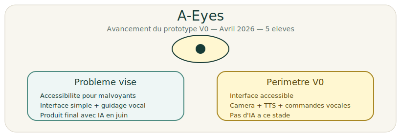

---

# Vue d'ensemble de l'avancement

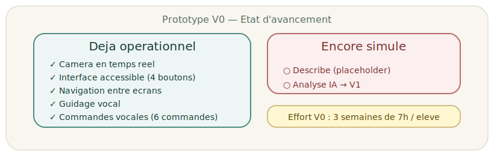

---

# Interface accessible

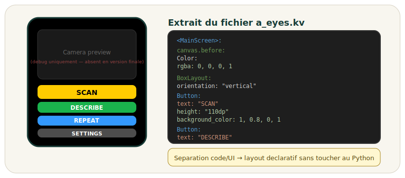

---

# Architecture threads (Inputs / Outputs)

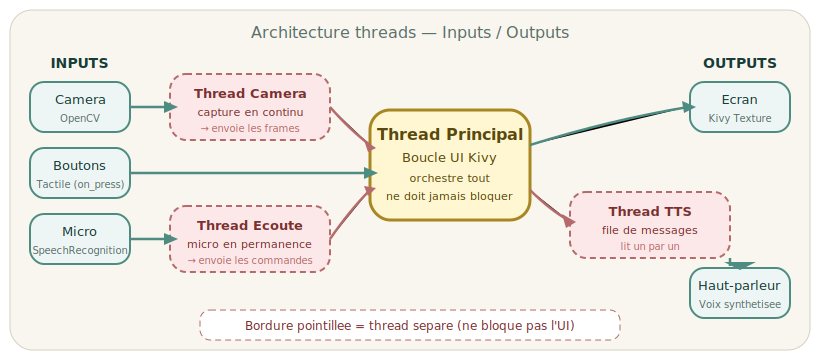

---

# Architecture modulaire et choix techniques

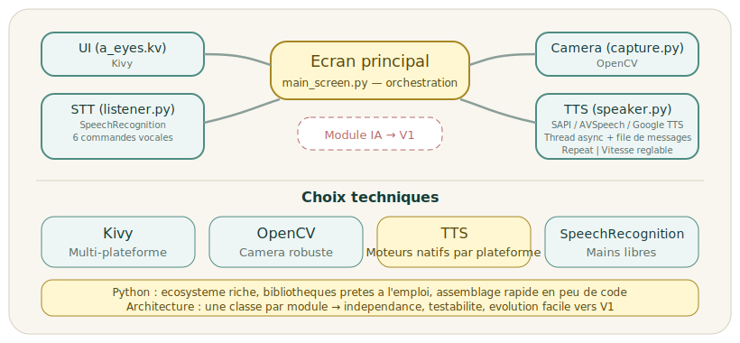

---

# Limites actuelles et points ouverts

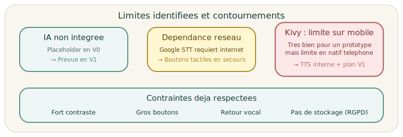

---

# Demo du prototype V0

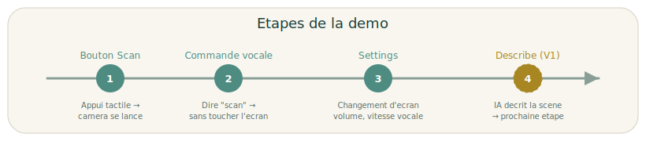

> Les etapes 1 a 3 sont fonctionnelles dans le V0.
> L'etape 4 (IA) est la prochaine priorite.

---

# Estimation de l'effort realise

<table width="100%"><tr>
<td width="33%" align="center">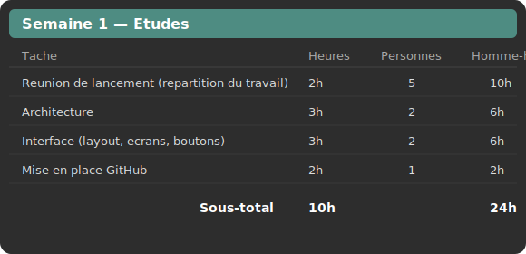</td>
<td width="33%" align="center">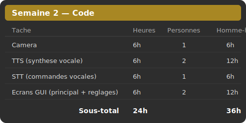</td>
<td width="33%" align="center">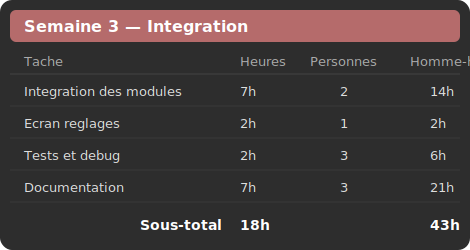</td>
</tr></table>

> **Total V0 : 3 semaines — 103 homme-heures (equipe de 5)**

---

# Synthese et prochaines priorites

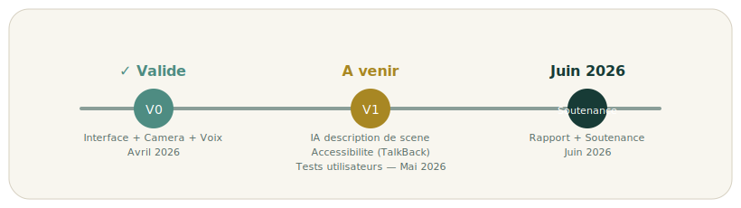

 

> Prochaine priorite : brancher l'IA pour que le bouton **Describe** donne un vrai resultat

**Merci — Questions ?**

